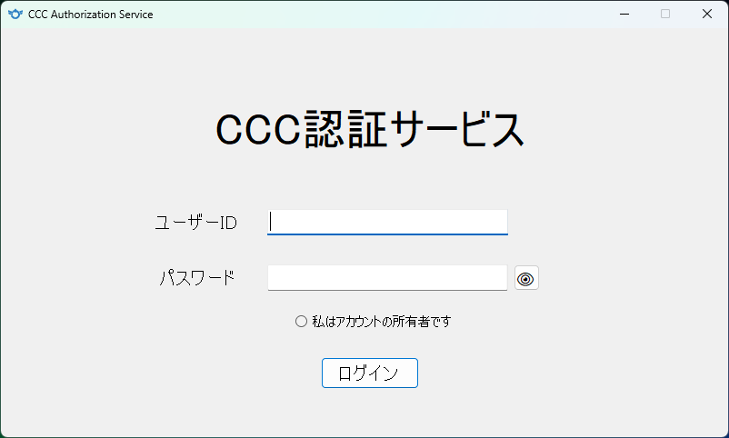

# CCC24-Test1

## CCC Authorization Service

### 課題

- [ ] アプリのタイトルを **Form1** から **CCC Authorization Service** に変える
- [ ] アプリを起動した時点で、いつ Enter キーを押しても、｢**ログイン**｣ボタンが押下できる
- [ ] パスワードの表示/非表示ボタンを実装
- [ ] 以下の場合、全て別のエラーを返す
  - ユーザーIDが入力されていない
  - パスワードが入力されていない
  - パスワードが４文字未満
  - ユーザーIDが存在しない
  - ユーザーIDに対するパスワードが間違っている
  - ｢**私はアカウントの所有者です**｣のラジオボタンが選択されていない
- [ ] ｢**ログイン**｣のボタンを押した時に、アプリ内全体で 0.1～１秒間、ポインタを待ち状態のエフェクトに変更
- [ ] ログインに成功した場合、アプリを終了または再起動する
- [ ] ユーザーの構成情報は次の通り
  - ID: **guest**  
    PW: **guest**
  - ID: **admin**  
    PW: **shiga**

### 注記

- [**favicon**.ico](/favicon.ico)  
  **滋賀県教育委員会** のサイトを参照  
  <https://www.pref.shiga.lg.jp/favicon.ico>